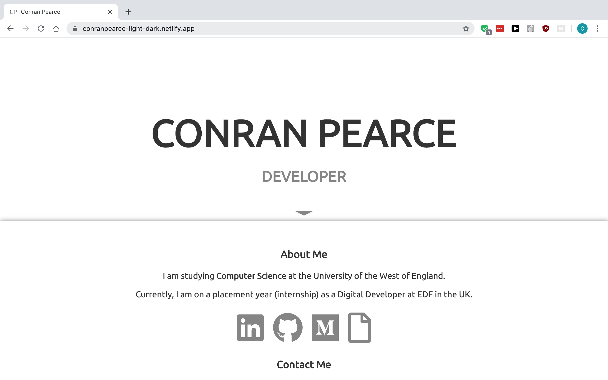
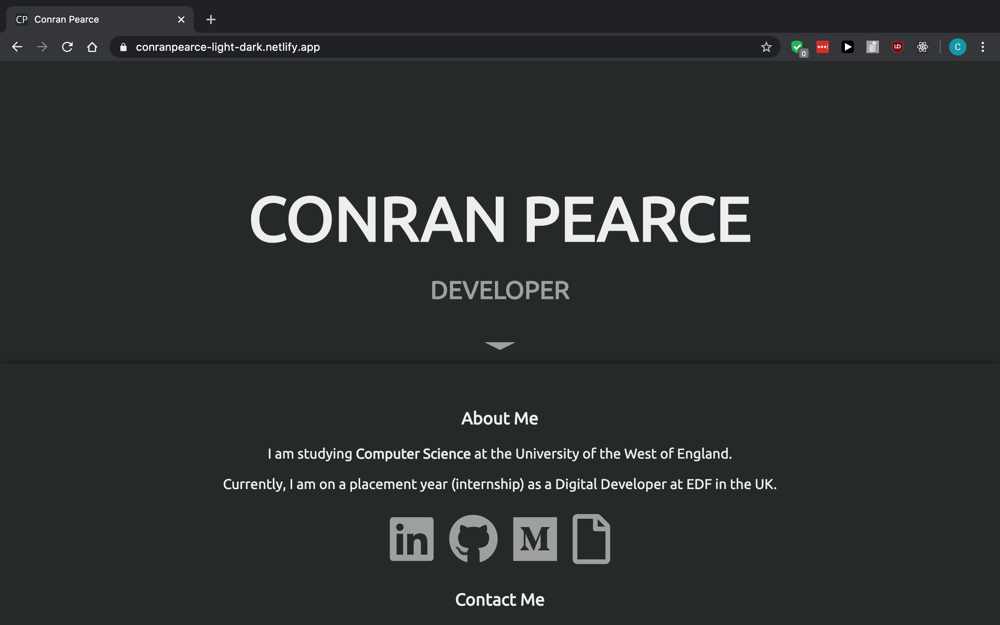
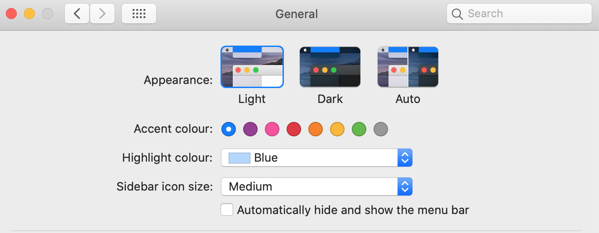
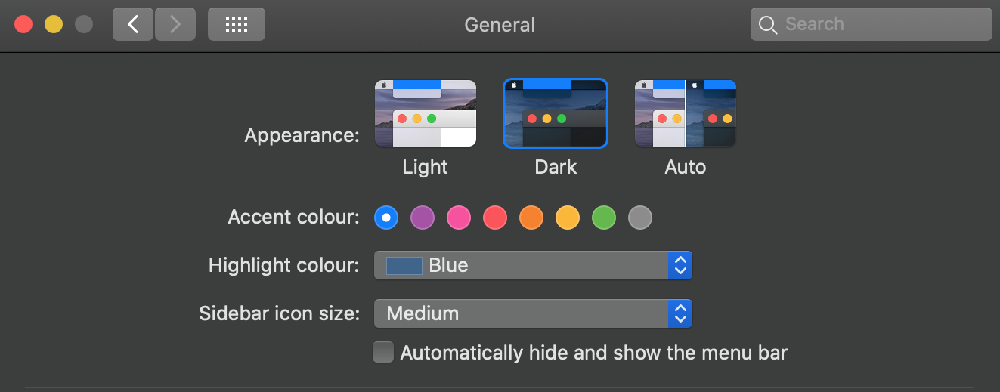

<h1 align="center">
  <a href="https://conranpearce-light-dark.netlify.app/">:sunny: :new_moon: Light & Dark Theme</a>
</h1>

<p align="center">Basic static website for displaying information about myself :man:</p>

<p align="center">JavaScript, HTML5 and CSS3 have been used to create the website.</p>

<p align="center">This project is based on my GitHub pages website which you can find at https://conranpearce.github.io/</p>

<p>
  
  
</p>

## Deployment

Netlify has been linked to the GitHub repository to be able to have a live site up to date with the code being committed.

Production branch hosted using Netlify live site at https://conranpearce-light-dark.netlify.app/

## Prerequisites

There are no prerequisites for this site.

## Compatability :computer: :iphone:

This site has currently only been tested on a Macbook, where the light and dark theme works across Google Chrome, Firefox and Safari.

## Usage

Using macOS (Mojave 10.14 onwards) light and dark mode is compatible.

Steps to use light and dark mode:
- Go into ```System Preferences```
- Then select ```General```
- At the top you shall see the options for ```Light``` and ```Dark``` mode

<p>
  
  
</p>
